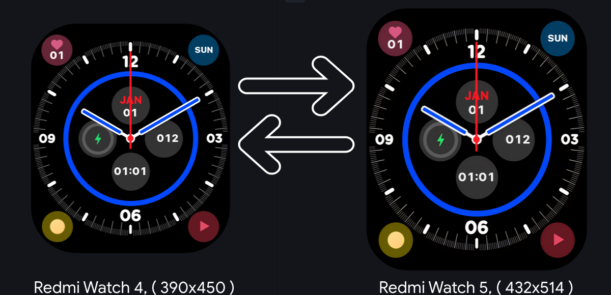
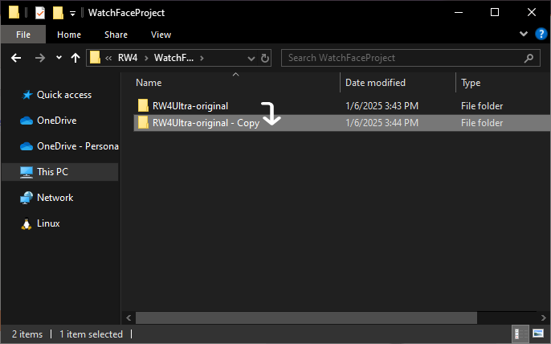
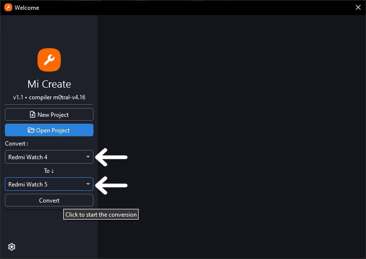
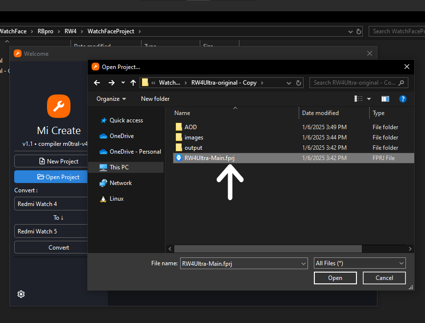
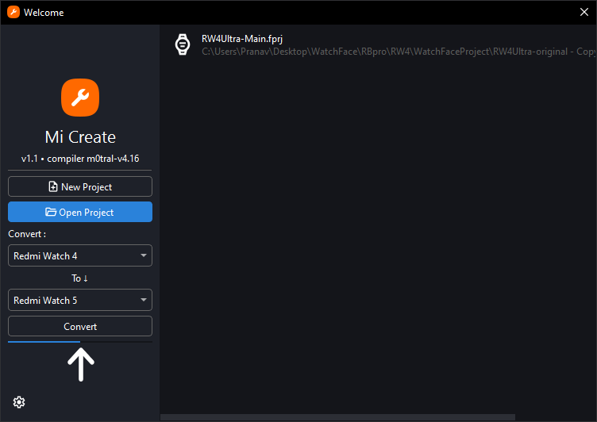
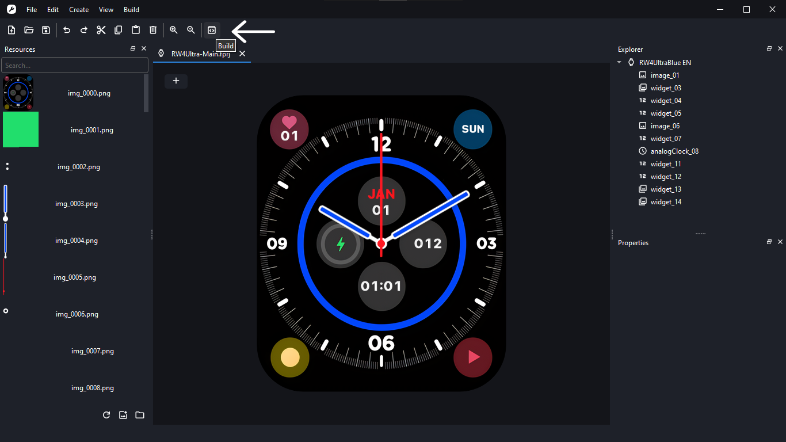
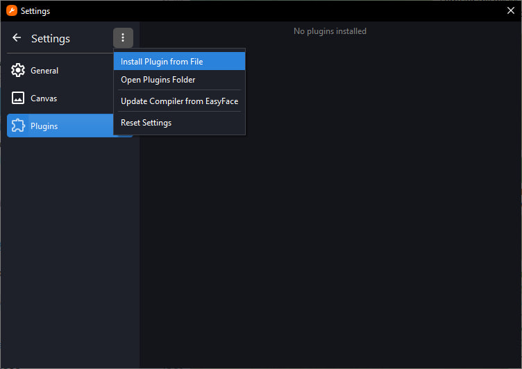
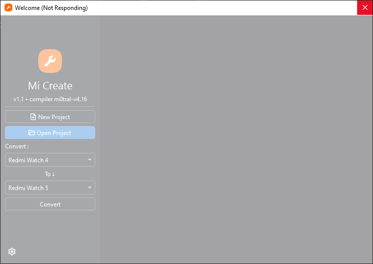

# Mi-Create-ConvertPlugin

This is a Plugin for Mi-Create. It convert watchfaces from one model to another model.
This plugin converts watchfaces resources to fit to another devices shape and size.
Please report any issues to https://t.me/Pranav_8393
 

 Compatible with all Xiaomi wearables made ~2021 and above.

 Designed for Lazy and Creative People. It Helps save time. Create Once Use everywhere

### Thanks to Ooflet for [Mi-Create](https://github.com/ooflet/Mi-Create)

## Key Features:
- Convert watch faces between Xiaomi devices.
- Supports Lossless PNG Compression. (helpful for animated watch faces)
- Supports 8-bit conversion

## How To Convert:
1. **Make a copy** of the project you want to convert.
NOTE: Please use copy of the original project, this plugin will overwrite all the original work. 

2. **Select device types** in the Convert menu.
3. Choose the `.fprj` project file.

4. **Wait** for the progress bar to finish
.
NOTE: sometimes it might briefly go into the "Not Responding" state; give it one minute

5. After conversion, click "Build" to compile the project.

### Compatibility Notes:
- Supported devices-

        Mi Color2/S1/S2,
        Mi Watch S1 pro,
        Redmi Watch 3,
        Redmi Watch 3 Active,
        Redmi Watch 5 Active,
        Redmi Watch 5 Lite,
        Redmi Band Pro,
        Mi band 8,
        Mi band 9,
        Mi band 10,
        Mi band 9 pro,
        Mi band 8 pro,
        Mi band 7 pro,
        Mi watch S3,
        Mi watch S4,
        Redmi Watch 4,
        Redmi Watch 5

- Always work with a copy of the project as the conversion process overwrites original images.

---

## Installation (Windows Only):

### 
1. Download and install the latest Version of [Mi-Create](https://github.com/ooflet/Mi-Create/releases).
2. Download plugin ( `.plg` file) file from [releases](https://github.com/Pranav-ONLY/Mi-Create-ConvertPlugin/releases)
3. Go to settings -> click on menu ( ⋮ )three dots.
4. Select downloaded plugin file ( `.plg` file) and wait for it to show up.

## Troubleshooting
Mi-Create-Convert may encounter occasional bugs or issues. Common troubleshooting steps:
- If the app freezes or shows "Not Responding," wait at least 1-2 minute, it is still working.
---
## Additional Resources
- [Documentation for Mi-Create](https://ooflet.github.io/docs)
- [Discussions](https://github.com/ooflet/Mi-Create/discussions) for questions and ideas
- [Issue Tracker](https://github.com/ooflet/Mi-Create/issues) for bug reports and feature requests